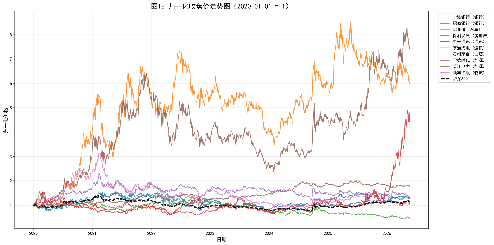
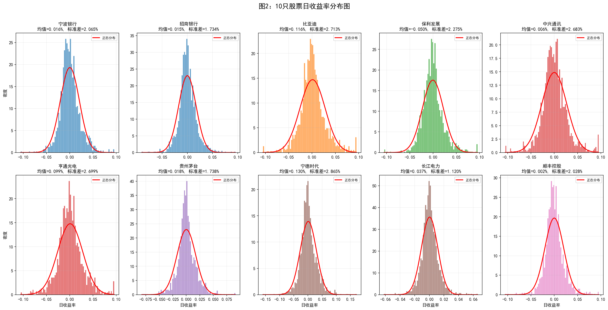
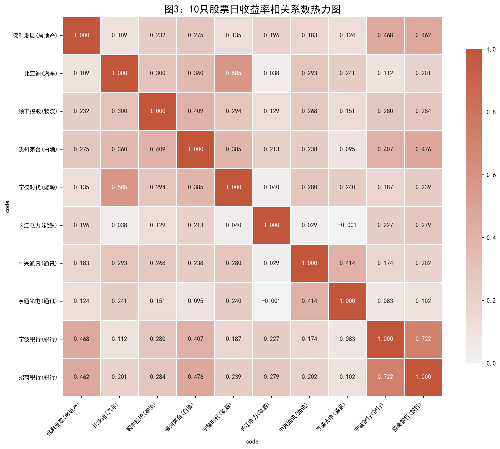
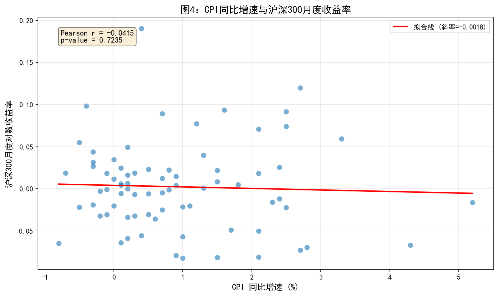
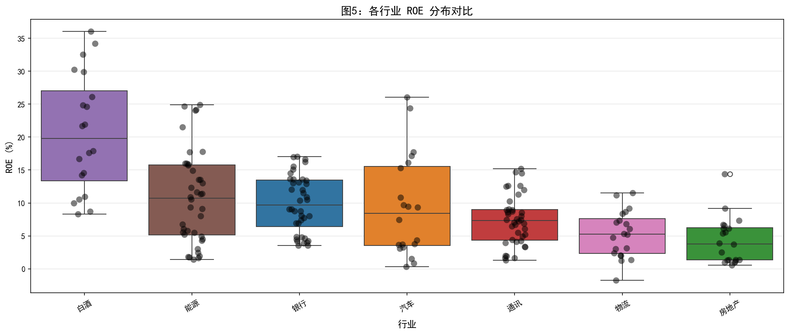
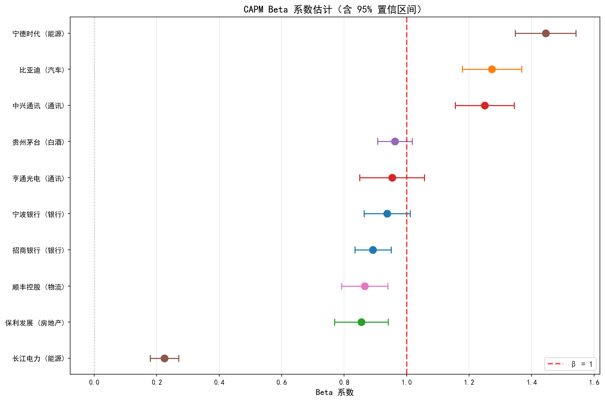

# 描述性统计与回归分析

## 描述性统计

计算 10 只股票日对数收益率 $r_t = \ln(P_t / P_{t-1})$ 的描述性统计指标：

| 股票 | 行业 | 年化均值 | 年化波动率 | 偏度 | 峰度 | 最大回撤 |
|------|------|---------|----------|------|------|---------|
| 宁波银行 | 银行 | 4.06% | 32.77% | 0.4965 | 2.4540 | -60.55% |
| 招商银行 | 银行 | 3.74% | 27.52% | 0.2702 | 3.2258 | -54.64% |
| 比亚迪 | 汽车 | 29.29% | 43.07% | 0.3103 | 2.1110 | -56.05% |
| 保利发展 | 房地产 | -12.61% | 36.11% | 0.5567 | 3.1547 | -74.20% |
| 中兴通讯 | 通讯 | 1.40% | 42.59% | 0.3012 | 2.4377 | -69.84% |
| 亨通光电 | 通讯 | 25.02% | 42.84% | 0.2925 | 1.8284 | -61.95% |
| 贵州茅台 | 白酒 | 4.50% | 27.58% | 0.2619 | 3.6370 | -54.22% |
| 宁德时代 | 能源 | 32.76% | 45.47% | 0.3835 | 3.1285 | -68.89% |
| 长江电力 | 能源 | 9.38% | 17.79% | 0.3681 | 3.5370 | -17.91% |
| 顺丰控股 | 物流 | 0.56% | 32.19% | 0.3826 | 3.6272 | -75.67% |

**解读**：
- 宁德时代（32.76%）和比亚迪（29.29%）年化收益率最高，受益于新能源产业发展
- 保利发展（-12.61%）为唯一负收益，反映房地产行业调整压力
- 长江电力波动率最低（17.79%），防御属性突出
- 所有股票偏度为正、峰度大于 0，符合金融资产尖峰厚尾特征

## 可视化分析

### 图 1：归一化收盘价走势图

以 2020-01-01 = 1 为基准的归一化价格走势，按行业分组着色。

**解读**：宁德时代和比亚迪涨幅领先；贵州茅台走势稳健；银行和房地产股相对平淡。2022年市场整体回调明显。

### 图 2：日收益率分布图

2×5 分面直方图，叠加正态分布曲线。

**解读**：分布呈现尖峰厚尾特征，符合金融资产非正态性。标准差大的股票（宁德时代）分布更分散，波动风险更高。

### 图 3：收益率相关系数热力图

按行业排序的 Pearson 相关系数矩阵。

**解读**：同行业股票相关性较高（如招商银行与宁波银行），跨行业相关性较低。同一行业的股票受共同行业因素驱动，走势更趋一致。

### 图 4：宏观指标与股市关系

CPI 同比增速与沪深 300 月度收益率散点图，叠加线性拟合线。Pearson $r = -0.0415$（$p = 0.7235$）。

**解读**：CPI 与市场收益率无显著线性关系，说明通胀只是影响股市的众多因素之一。

### 图 5：财务指标跨公司对比

各行业 ROE 分布箱型图。

**解读**：白酒行业 ROE 最高，反映品牌溢价能力；银行股 ROE 稳定；不同行业 ROE 差异反映了资本结构和盈利模式的不同。

## CAPM 回归分析

### 模型设定

$$r_{i,t} - r_f = \alpha_i + \beta_i (r_{m,t} - r_f) + \varepsilon_{i,t}$$

其中：
- $r_{i,t}$：个股日对数收益率
- $r_{m,t}$：沪深 300 日对数收益率
- $r_f$：年化 2.0%，日频 $0.02 / 252$

### 回归结果

| 股票 | 行业 | $\hat{\alpha}$ | p值 | $\hat{\beta}$ | 95% CI | $R^2$ |
|------|------|---------------|-----|--------------|--------|-------|
| 宁波银行 | 银行 | 0.53% | 0.9047 | 0.9372 | [0.8638,1.0106] | 0.2900 |
| 招商银行 | 银行 | 0.51% | 0.8846 | 0.8919 | [0.8339,0.9499] | 0.3714 |
| 比亚迪 | 汽车 | 10.57% | 0.0659 | 1.2730 | [1.1779,1.3681] | 0.3090 |
| 保利发展 | 房地产 | -5.97% | 0.2496 | 0.8547 | [0.7688,0.9406] | 0.1981 |
| 中兴通讯 | 通讯 | -0.50% | 0.9305 | 1.2494 | [1.1550,1.3438] | 0.3043 |
| 亨通光电 | 通讯 | 8.94% | 0.1522 | 0.9532 | [0.8499,1.0566] | 0.1750 |
| 贵州茅台 | 白酒 | 0.80% | 0.8117 | 0.9620 | [0.9067,1.0173] | 0.4301 |
| **宁德时代** | **能源** | **11.91%** | **0.0419** | **1.4448** | **[1.3480,1.5417]** | **0.3570** |
| 长江电力 | 能源 | 2.94% | 0.2897 | 0.2246 | [0.1786,0.2706] | 0.0565 |
| 顺丰控股 | 物流 | -0.55% | 0.9023 | 0.8655 | [0.7916,0.9394] | 0.2551 |

### Beta 系数可视化

### 讨论

#### 问题 1：哪些股票 $\hat{\beta} > 1$？

**宁德时代**（$\beta = 1.4448$，能源）、**比亚迪**（$\beta = 1.2730$，汽车）、**中兴通讯**（$\beta = 1.2494$，通讯）的 Beta 大于 1。这些属于进攻型股票，对市场波动更敏感。这与"周期性 vs 防御性"行业分类基本吻合——能源、汽车行业周期性较强。

#### 问题 2：$\hat{\alpha}$ 是否显著？

仅**宁德时代**的 Alpha 在 5% 水平显著（$p = 0.0419$），Alpha = 11.91%。这意味着宁德时代在 CAPM 调整市场风险后仍有显著的超额收益，反映了其在新能源领域的领先地位和成长性。

#### 问题 3：$R^2$ 差异解释

- **$R^2$ 最高**：贵州茅台（0.4301），收益约 43% 可由市场解释，因其大市值、高机构持股
- **$R^2$ 最低**：长江电力（0.0565），收益主要受公司特有因素（来水量、电价政策等）驱动，与市场联动性弱

## 结论

1. **行业分化显著**：新能源（宁德时代、比亚迪）表现最佳，房地产最弱
2. **风险收益匹配**：高收益伴随高波动
3. **行业内部高相关**：同行业股票受共同因素驱动
4. **CAPM 适用性**：贵州茅台最适合 CAPM 解释（$R^2=0.43$），长江电力最不适合（$R^2=0.06$）
5. **数据存储**：Parquet 比 CSV 快 6.7 倍、小 2.4 倍
